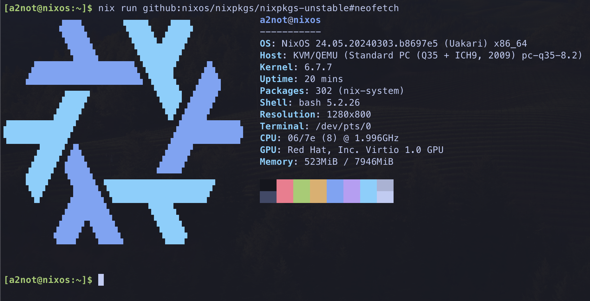

Shout-out to patry4815 for pioneering the same idea in his repo; [patryk4815/ctftools](https://github.com/lima-vm/lima/discussions/430#discussioncomment-2645108).
This repo is basically the same as ctftools repo.

Also, shout-out to kasuboski for the informative blog post, [NixOS Dev Environment on Mac](https://www.joshkasuboski.com/posts/nix-dev-environment/), as well as the repo achieving NixOS in lima.

# nixos-in-lima

[](https://github.com/a2not/nixos-in-lima/actions/workflows/build_img.yaml)

## Generating the image

First we need to generate NixOS image, which requires a linux machine so here we'll use default (ubuntu) lima VM.

```bash
# create ubuntu VM as nixos-builder
limactl start template://default --name=nixos-builder
```

From then on, prefix with `limactl shell nixos-builder` if you want to run each command from Mac host machine.
Here we'll do everything inside of nixos-builder.

```bash
# install nix
sh <(curl -L https://nixos.org/nix/install) --daemon

# enable kvm feature, and nix flakes
echo "system-features = nixos-test benchmark big-parallel kvm" | sudo tee -a /etc/nix/nix.conf
echo "experimental-features = nix-command flakes" | sudo tee -a /etc/nix/nix.conf

# <C-d> to quit, reboot the vm
limactl stop nixos-builder && limactl start nixos-builder && limactl shell nixos-builder


# setup nix environment
## would be unable to create symlink in this repo location since it is readonly file system from lima vm's standpoint
## so clone repo to the home dir first
cd
git clone https://github.com/a2not/nixos-in-lima.git
cd nixos-in-lima/

nix build .#packages.x86_64-linux.img
cp $(readlink result)/nixos.img /tmp/lima/nixos-x86_64.img
# <C-d> to quit, but keep the VM running in the background
```


On your mac:
* Move `nixos-x86_64.img` under `imgs`

```bash
mkdir -p ./imgs/
mv /tmp/lima/nixos-x86_64.img ./imgs/
```

## Running NixOS
```bash
limactl start --name=nixos nixos-x86_64.yaml
limactl shell nixos

# switch to this repo directory
nixos-rebuild switch --flake .#nixos --use-remote-sudo
```

## Result

```
$ uname -a
Linux nixos 6.7.7 #1-NixOS SMP PREEMPT_DYNAMIC Fri Mar  1 12:42:00 UTC 2024 x86_64 GNU/Linux
```



At first I started thinking about this idea in order to migrate my dev environment into NixOS, but since I know nothing about Nix either, no idea what to do next.
I'll go ahead and acclimatize Nix as a package manager in both my current linux setup and MacOS, so that I can appreciate the benefits of NixOS...


Running NixOS VM can be done solely with qemu as well, see this; [NixOS virtual machines](https://nix.dev/tutorials/nixos/nixos-configuration-on-vm)
